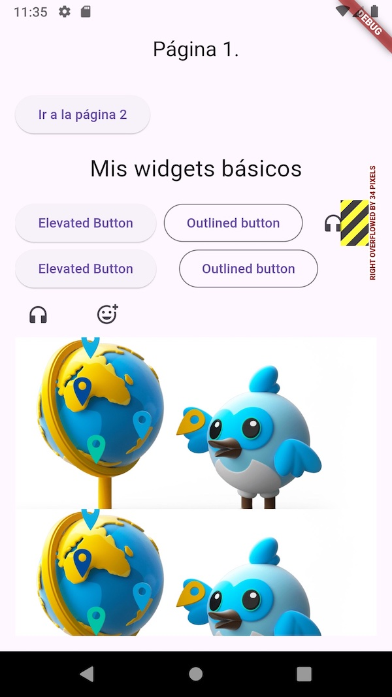
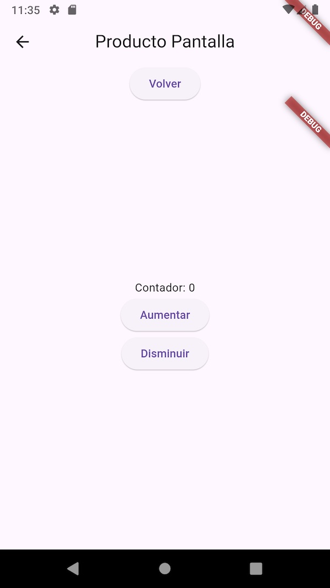

# experimento3

# Flutter Widgets Showcase

Este repositorio contiene una colección de ejemplos de uso de diversos widgets en Flutter. La aplicación demuestra la implementación y funcionalidad de botones, organización de elementos en filas, espaciadores, uso de imágenes y manejo de estados.

## Características

### Botones
- **ElevatedButton**: Botón elevado utilizado para representar acciones principales.
- **OutlinedButton**: Botón con borde utilizado para acciones secundarias.
- **IconButton**: Botón que contiene solo un ícono, utilizado para acciones rápidas.

### Uso de Row
- Posiciona elementos en una fila horizontal, permitiendo un diseño flexible y responsivo.

### SizedBox
- Utilizado para definir ancho y alto entre elementos, creando espacios consistentes.

### Wrap
- Ajusta elementos de forma horizontal, permitiendo un diseño fluido incluso con múltiples elementos.
- **Spacing**: Controla el espacio entre los elementos dentro del `Wrap`.

### Uso de Imágenes
- **Imágenes en línea**: Carga y muestra imágenes desde URLs.
- **Imágenes locales**: Muestra imágenes almacenadas localmente en los activos de la aplicación.

### Estados: State
- Gestión del estado utilizando la clase `State`, permitiendo cambios dinámicos en la interfaz de usuario.

## Capturas

| Pantalla 1 | Pantalla 2 |
|-----------|-----------|
|  |  |
