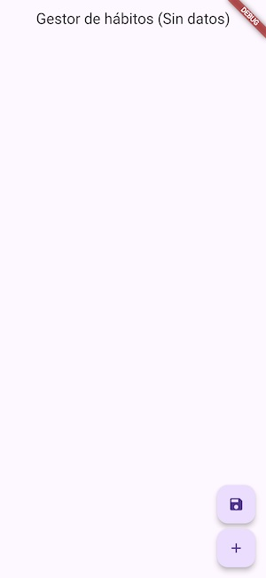
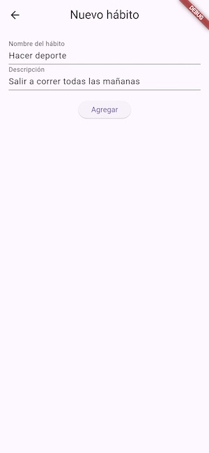
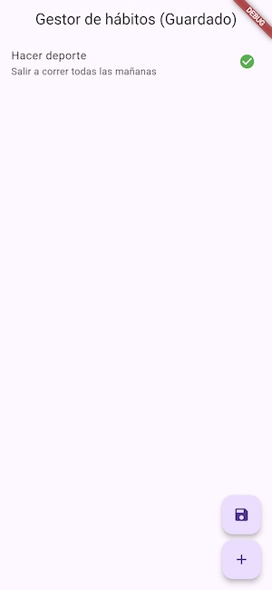

# Experimento4. Gestor de Hábitos 📋

## Descripción del Proyecto 📝

Este proyecto es una aplicación de gestión de hábitos desarrollada en Flutter. Permite a los usuarios agregar, visualizar y cambiar el estado de sus hábitos diarios. La aplicación también utiliza `SharedPreferences` para almacenar datos de manera persistente. La estructura del proyecto está organizada en varios archivos para mantener un código limpio y modular.

## Características Principales ✨

- **Gestión de Hábitos:** Agrega y gestiona tus hábitos diarios de manera eficiente.
- **Persistencia de Datos:** Utiliza `SharedPreferences` para guardar tus datos de manera persistente.
- **Interfaz de Usuario Intuitiva:** Una interfaz amigable y fácil de usar para gestionar tus hábitos.
- **Organización del Código:** Código modular y bien organizado para facilitar la mantenibilidad.

## Estructura del Proyecto 🗂️

### 1. `pantalla_habitos.dart` 📄

Este archivo contiene la lógica principal de la pantalla de gestión de hábitos. Aquí se manejan las funciones para agregar nuevos hábitos, cambiar el estado de los hábitos existentes y guardar los datos en `SharedPreferences`.

**Características:**
- **Clase `PantallaHabitos`:** Widget con estado que representa la pantalla principal de la aplicación.
- **Funciones de Gestión de Estado:** Funciones como `iniciarPreferencias`, `guardarDatos`, `obtenerDatos`, `_agregarHabito` y `cambiarEstado`.
- **Interfaz de Usuario:** Construcción de la interfaz de usuario utilizando `Scaffold`, `AppBar`, `ListView.builder` y `FloatingActionButton`.

### 2. `pantalla_nuevo_habito.dart` 📄

Este archivo contiene la pantalla para agregar un nuevo hábito. Proporciona un formulario simple donde los usuarios pueden ingresar el nombre y la descripción del nuevo hábito.

**Características:**
- **Clase `PantallaNuevoHabito`:** Widget con estado que representa la pantalla para agregar un nuevo hábito.
- **Controladores de Texto:** Controladores para manejar la entrada de texto del nombre y la descripción del hábito.
- **Interfaz de Usuario:** Formulario de entrada de texto utilizando `TextField` y un botón de envío utilizando `ElevatedButton`.

### 3. `habito.dart` 📄

Este archivo contiene la clase `Habito`, que representa un modelo de datos para un hábito.

**Características:**
- **Clase `Habito`:** Modelo de datos con atributos `nombre`, `descripcion` y `completado`.
- **Método `toString`:** Método sobrescrito para proporcionar una representación en cadena del objeto `Habito`.

## Capturas de pantalla.

| Principal | Agregar hábito | Principal con datos |
|--------------|--------------|--------------|
||||

