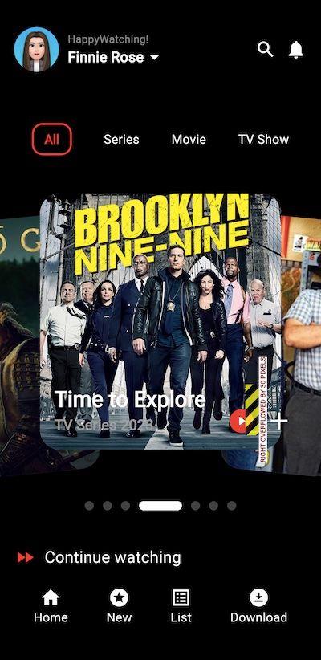
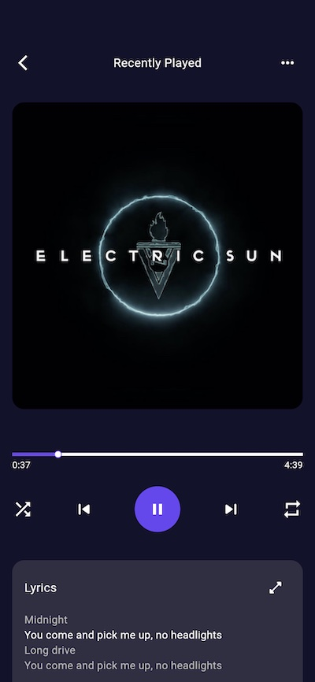

# Experimento 6.

# Proyecto App de Películas y series

## Descripción
El proyecto de Movies Screen es una aplicación desarrollada en Flutter que presenta una interfaz de usuario atractiva y funcional para la visualización de contenido multimedia. El proyecto incluye varios widgets personalizados que componen la estructura principal de la pantalla, ofreciendo una experiencia de usuario enriquecida y dinámica. 

### Componentes Principales
1. **MoviesAppbarWidget**: Un widget personalizado que crea una barra de aplicación estilizada con iconos y texto personalizado para la aplicación de películas.
2. **MoviesPlayerWidget**: Un widget que contiene el reproductor multimedia principal, con filtros y carrusel de imágenes para una experiencia de navegación de contenido fluida.
3. **MoviesContinueWidget**: Un widget que muestra opciones de navegación adicional, permitiendo al usuario continuar viendo contenido o explorar nuevas opciones.
4. **MoviesScreen**: La pantalla principal que integra los widgets anteriores y presenta el contenido en un formato organizado y visualmente atractivo.

## Tecnologías Utilizadas
- **Flutter**: Framework principal para la construcción de la interfaz de usuario.
- **Dart**: Lenguaje de programación utilizado para el desarrollo de la aplicación.
- **Material Design**: Diseño de interfaz basado en las directrices de Material Design para una experiencia de usuario intuitiva y cohesiva.

# Proyecto App de Audio y música

## Descripción
El proyecto de Audio Screen es una aplicación desarrollada en Flutter que proporciona un reproductor de audio avanzado con una interfaz de usuario intuitiva y controles de reproducción interactivos. El proyecto integra varios widgets personalizados para manejar diferentes aspectos del reproductor de audio, ofreciendo una experiencia auditiva y visual envolvente.

### Componentes Principales
1. **AudioAppbarWidget**: Un widget personalizado que crea una barra de aplicación estilizada con opciones de navegación para el reproductor de audio.
2. **AudioControlsWidget**: Un widget que proporciona los controles de reproducción de audio, incluyendo play, pause, skip, y repeat, junto con una barra de progreso visual.
3. **AudioImageContainerWidget**: Un widget que muestra la imagen del álbum o del contenido que se está reproduciendo, con efectos visuales atractivos.
4. **AudioLyricsWidget**: Un widget que muestra las letras de la canción en reproducción, permitiendo al usuario expandir y colapsar la vista según su preferencia.
5. **AudioScreen**: La pantalla principal que integra todos los widgets anteriores y gestiona la lógica de reproducción de audio utilizando `just_audio`.

## Tecnologías Utilizadas
- **Flutter**: Framework principal para la construcción de la interfaz de usuario.
- **Dart**: Lenguaje de programación utilizado para el desarrollo de la aplicación.
- **just_audio**: Paquete utilizado para la reproducción de audio.
- **Material Design**: Diseño de interfaz basado en las directrices de Material Design para una experiencia de usuario intuitiva y cohesiva.

## Capturas de pantalla.

| Películas y series     | Audio y música     |
|---------------|---------------|
|||

