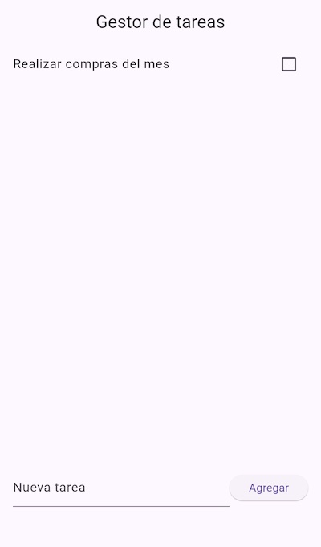

# Experimento 7. 

## Gestor de tareas con BLoC (Business Logic Component)

Bloc es una arquitectura para gestionar el estado de una aplicación. Se basa en el patrón observador y separa la lógica de negocio de la interfaz de usuario.

### ¿Cómo funciona Bloc?

- **Eventos**: Representan acciones que pueden ocurrir en la aplicación, como pulsar un botón o recibir datos de una API.
- **Estados**: Representan el estado actual de la aplicación, como los datos cargados o el estado de carga.
- **Bloc**: Es el componente central que escucha los eventos, realiza la lógica de negocio y emite nuevos estados.
- **Widgets**: Escuchan los cambios de estado del Bloc y actualizan la interfaz de usuario en consecuencia.

### Ventajas de usar Bloc:

- **Separación de responsabilidades**: La lógica de negocio se separa de la interfaz de usuario, lo que hace que el código sea más modular y fácil de mantener.
- **Testeabilidad**: Al separar la lógica de negocio, es más fácil escribir pruebas unitarias para el Bloc.
- **Reutilización**: Los Blocs pueden ser reutilizados en diferentes partes de la aplicación o incluso en otras aplicaciones.
- **Escalabilidad**: La arquitectura Bloc es escalable y puede adaptarse a aplicaciones de cualquier tamaño.

### Captura de pantalla

