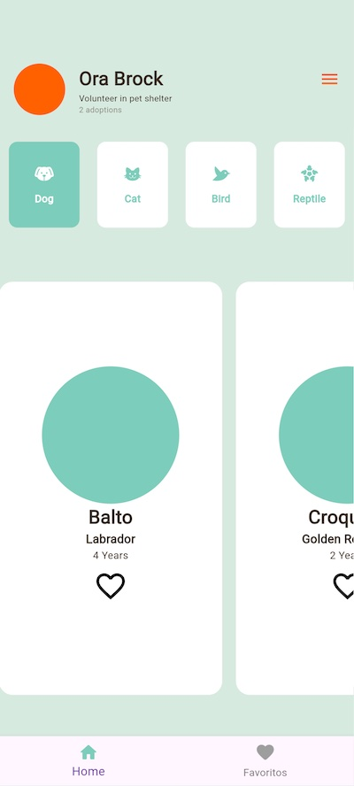
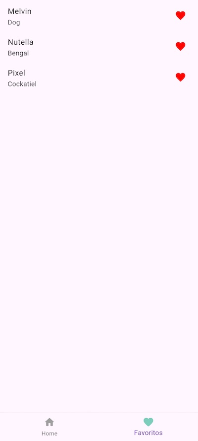

# Experimento 8.

# AdoptMe: Animal Adoption App

## Descripción

AdoptMe es una aplicación móvil desarrollada con Flutter que facilita la adopción de animales. Los usuarios pueden explorar y marcar animales como favoritos, filtrarlos por categorías y acceder fácilmente a sus favoritos. La app utiliza el patrón BLoC (Business Logic Component) para gestionar la lógica de estado y asegurar un flujo de datos limpio y reactivo.

## Características

- **Explorar Animales**: Visualiza una lista de animales disponibles para adopción con información detallada.
- **Filtrar Animales**: Filtra animales por tipo (perros, gatos, aves, reptiles, etc.).
- **Marcar como Favoritos**: Selecciona y desmarca animales como favoritos con un solo clic.
- **Página de Favoritos**: Accede rápidamente a la lista de animales marcados como favoritos.

## Estructura del Proyecto

```plaintext
experimento8/
├── lib/
│   ├── pages/
│   │   ├── adopt_page.dart
│   │   └── favorite_page.dart
│   ├── widgets/
│   │   ├── adopt_appbar.dart
│   │   ├── adopt_filter.dart
│   │   ├── adopt_list.dart
│   │   └── adopt_bottom_navigation_bar.dart
│   │   └── adopt_card_widget.dart
│   ├── bloc/
│   │   ├── animal_bloc.dart
│   │   ├── animal_event.dart
│   │   └── animal_state.dart
│   ├── data/
│   │   └── data.dart
│   ├── models/
│   │   └── animal_model.dart
│   └── main.dart
├── pubspec.yaml
```

## Capturas de pantalla

| Home | Favoritos |
|---|---|
|||


